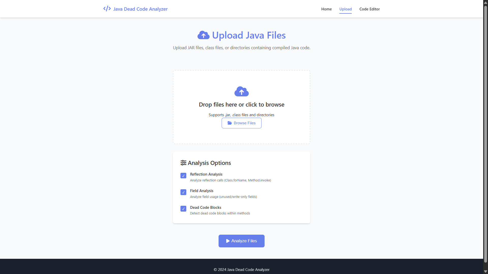
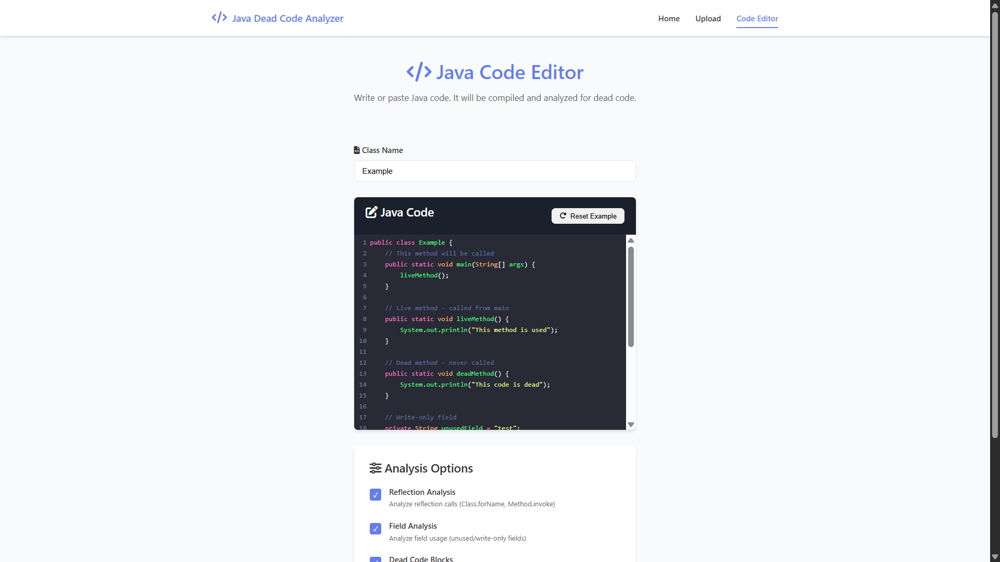
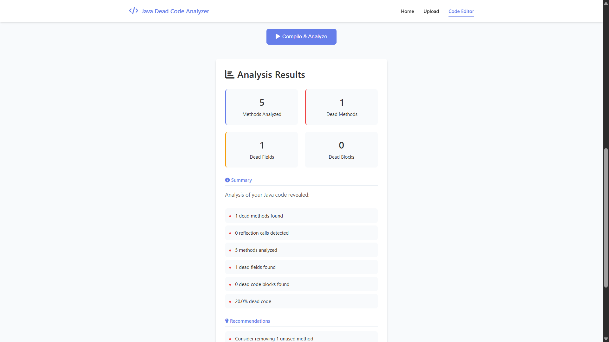

# Java Bytecode Dead Code Analyzer

A comprehensive static analysis tool for Java bytecode that identifies dead methods, unused fields, and unreachable code blocks. The analyzer works directly on compiled `.class` files and JAR archives, making it perfect for analyzing production code without requiring source access.






## 🎯 Features

### Core Capabilities
- **Dead Method Detection**: Identifies methods that are never called, including those unreachable from entry points
- **Dead Field Analysis**: Finds unused and write-only fields across your codebase
- **Dead Code Blocks**: Detects unreachable code blocks within live methods (e.g., code after `return` statements or in `if(false)` blocks)
- **Reflection Analysis**: Intelligently detects methods called via Java Reflection API (`Class.forName`, `Method.invoke`, etc.)
- **Multiple Input Formats**: Supports `.class` files, JAR archives, ZIP files, WAR files, and EAR files

### User Interfaces
- **Web Application**: Modern, responsive web UI built with Spring Boot
  - Upload bytecode files for analysis
  - Interactive code editor with live compilation
  - Detailed results visualization with downloadable reports
- **Command-Line Interface**: Programmatic access for CI/CD pipelines and scripts

### Analysis Features
- **Call Graph Construction**: Builds complete call graphs from bytecode to track method invocations
- **Entry Point Resolution**: Automatically identifies `main()` methods and other entry points
- **Reachability Analysis**: Uses graph traversal algorithms (DFS/BFS) to determine code reachability
- **Control Flow Analysis**: Analyzes bytecode instructions to detect unreachable code paths

## 🏗️ Architecture

The project follows a layered architecture for clean separation of concerns:

```
┌─────────────────────────────────────────┐
│          Web Layer (Spring Boot)        │
│  - WebController, ApiController         │
└─────────────────────────────────────────┘
                    │
┌─────────────────────────────────────────┐
│         Orchestration Layer             │
│           Main.java                     │
└─────────────────────────────────────────┘
                    │
        ┌───────────┴───────────┐
        │                       │
┌───────────────┐      ┌──────────────────┐
│  Analysis     │      │   Bytecode       │
│  Layer        │      │   Layer          │
│  - Dead Method│      │   - ClassScanner │
│  - Dead Field │◄─────┤   - MethodScanner│
│  - Dead Block │      │   - Instruction  │
│  - Reflection │      │     Scanner      │
└───────────────┘      └──────────────────┘
        │                       │
        └───────────┬───────────┘
                    │
        ┌───────────┴───────────┐
        │                       │
┌───────────────┐      ┌──────────────────┐
│  Graph Layer  │      │   Model Layer    │
│  - CallGraph  │      │   - MethodInfo   │
│  - ControlFlow│      │   - FieldInfo    │
│    Graph      │      │   - ClassInfo    │
└───────────────┘      └──────────────────┘
```

### Key Components

1. **Bytecode Layer** (`bytecode/`): ASM-based bytecode reading
   - `ClassScanner`: Extracts class metadata
   - `MethodScanner`: Extracts method information
   - `InstructionScanner`: Analyzes bytecode instructions

2. **Model Layer** (`model/`): Data structures
   - `MethodInfo`: Method metadata (name, signature, access flags)
   - `FieldInfo`: Field metadata
   - `ClassInfo`: Class structure

3. **Graph Layer** (`graph/`): Program representation
   - `CallGraph`: Method call relationships
   - `ControlFlowGraph`: Control flow within methods

4. **Analysis Layer** (`analysis/`): Dead code detection logic
   - `DeadMethodAnalyzer`: Finds unused methods
   - `DeadFieldAnalyzer`: Finds unused fields
   - `DeadBlockAnalyzer`: Finds unreachable code blocks
   - `ReflectionAnalyzer`: Detects reflection-based calls

5. **Web Layer** (`web/`): Spring Boot REST API and controllers
   - `ApiController`: REST endpoints for analysis
   - `WebController`: Static page routing

## 🛠️ Technologies

- **Java 11+**: Core language (requires JDK, not just JRE)
- **Spring Boot 2.7.0**: Web framework and application server
- **ASM 9.6**: Bytecode manipulation and analysis library
- **Maven**: Build and dependency management

## 📋 Requirements

### Runtime Requirements
- **JDK 11 or higher** (required for compilation features in web editor)
- **Maven 3.6+** (for building)
- **Windows/Linux/macOS** (any OS with Java support)

### For Web Interface
- Modern web browser (Chrome, Firefox, Safari, Edge)
- Internet connection (for CDN resources like Font Awesome and CodeMirror)

## 🚀 Getting Started

### Building the Project

1. **Clone the repository** (or navigate to the project directory):
   ```bash
   cd "Java Bytecode Dead Code Analyzer"
   ```

2. **Build with Maven**:
   ```bash
   mvn clean compile
   ```

3. **Package as JAR**:
   ```bash
   mvn clean package
   ```
   The executable JAR will be created in `target/Java-Bytecode-Dead-Code-Analyzer-1.0-SNAPSHOT.jar`

### Running the Web Application

**Option 1: Using Maven**
```bash
mvn spring-boot:run
```

**Option 2: Using the JAR**
```bash
java -jar target/Java-Bytecode-Dead-Code-Analyzer-1.0-SNAPSHOT.jar
```

**Option 3: Using the run script (Windows)**
```cmd
run.bat
```

The web application will start on **http://localhost:8080**

### Using the Command-Line Interface

```bash
java -cp "target/classes;path/to/asm-9.6.jar;path/to/asm-tree-9.6.jar" org.example.Main <path-to-classes-or-jar>
```

Or using the packaged JAR:
```bash
java -jar target/Java-Bytecode-Dead-Code-Analyzer-1.0-SNAPSHOT.jar <path-to-classes-or-jar>
```

**Examples:**
```bash
# Analyze a directory of .class files
java -jar target/Java-Bytecode-Dead-Code-Analyzer-1.0-SNAPSHOT.jar ./test-classes

# Analyze a JAR file
java -jar target/Java-Bytecode-Dead-Code-Analyzer-1.0-SNAPSHOT.jar myapp.jar

# Analyze a single class file
java -jar target/Java-Bytecode-Dead-Code-Analyzer-1.0-SNAPSHOT.jar MyClass.class
```

## 📖 Usage Guide

### Web Interface

#### 1. Upload Analysis
1. Navigate to **http://localhost:8080/upload**
2. Drag and drop or select `.class`, `.jar`, `.zip`, `.war`, or `.ear` files
3. Configure analysis options:
   - ☑ Reflection Analysis
   - ☑ Field Analysis
   - ☑ Dead Code Blocks
4. Click **Analyze Files**
5. View detailed results with summary statistics

#### 2. Code Editor
1. Navigate to **http://localhost:8080/editor**
2. Enter your Java source code in the editor
3. Specify the class name
4. Configure analysis options
5. Click **Compile & Analyze**
6. The code will be compiled and analyzed automatically

#### 3. Results Page
- View standalone results at `/results.html`
- Results can be shared via URL parameters
- Download reports as JSON or HTML

### API Endpoints

#### Health Check
```http
GET /api/health
```
Returns service status and version information.

#### Upload and Analyze
```http
POST /api/analyze/upload
Content-Type: multipart/form-data

file: <bytecode-file>
includeReflection: true/false
includeFields: true/false
includeDeadBlocks: true/false
```

**Response:**
```json
{
  "success": true,
  "report": {
    "totalMethodsAnalyzed": 50,
    "totalDeadMethods": 5,
    "totalDeadFields": 3,
    "totalDeadBlocks": 2,
    "totalReflectionCalls": 4
  },
  "summary": {
    "methods": "50 methods analyzed",
    "deadMethods": "5 dead methods found",
    ...
  }
}
```

#### Analyze Source Code
```http
POST /api/analyze/code
Content-Type: application/json

{
  "code": "public class Example { ... }",
  "className": "Example",
  "includeReflection": true,
  "includeFields": true,
  "includeDeadBlocks": true
}
```

#### API Information
```http
GET /api/info
```
Returns available endpoints and supported file types.

### Report Structure

The analysis report contains:

```json
{
  "totalMethodsAnalyzed": 100,
  "totalDeadMethods": 10,
  "totalDeadFields": 5,
  "totalDeadBlocks": 3,
  "totalReflectionCalls": 8,
  "deadMethods": [
    {
      "className": "com.example.MyClass",
      "methodName": "unusedMethod",
      "signature": "(Ljava/lang/String;)V",
      "accessFlags": 1
    }
  ],
  "deadFields": [
    {
      "className": "com.example.MyClass",
      "fieldName": "unusedField",
      "type": "Ljava/lang/String;"
    }
  ]
}
```

## 📁 Project Structure

```
Java-Bytecode-Dead-Code-Analyzer/
├── pom.xml                          # Maven configuration
├── README.md                        # This file
├── run.bat                          # Windows run script
├── src/
│   ├── main/
│   │   ├── java/org/example/
│   │   │   ├── Main.java           # CLI entry point
│   │   │   ├── WebApplication.java # Spring Boot application
│   │   │   ├── analysis/           # Analysis algorithms
│   │   │   │   ├── DeadMethodAnalyzer.java
│   │   │   │   ├── DeadFieldAnalyzer.java
│   │   │   │   ├── DeadBlockAnalyzer.java
│   │   │   │   ├── ReflectionAnalyzer.java
│   │   │   │   └── ...
│   │   │   ├── bytecode/           # Bytecode reading
│   │   │   │   ├── ClassScanner.java
│   │   │   │   ├── MethodScanner.java
│   │   │   │   └── InstructionScanner.java
│   │   │   ├── graph/              # Graph structures
│   │   │   │   ├── CallGraph.java
│   │   │   │   ├── ControlFlowGraph.java
│   │   │   │   └── GraphNode.java
│   │   │   ├── model/              # Data models
│   │   │   │   ├── MethodInfo.java
│   │   │   │   ├── FieldInfo.java
│   │   │   │   ├── ClassInfo.java
│   │   │   │   └── ...
│   │   │   ├── report/             # Reporting
│   │   │   │   ├── Report.java
│   │   │   │   ├── ConsoleReporter.java
│   │   │   │   └── ClassPathScanner.java
│   │   │   ├── util/               # Utilities
│   │   │   │   └── AccessFlagUtils.java
│   │   │   └── web/                # Web layer
│   │   │       ├── ApiController.java
│   │   │       └── WebController.java
│   │   ├── resources/
│   │   │   ├── application.properties
│   │   │   └── static/             # Web frontend
│   │   │       ├── index.html
│   │   │       ├── upload.html
│   │   │       ├── editor.html
│   │   │       ├── results.html
│   │   │       ├── css/
│   │   │       │   └── style.css
│   │   │       └── js/
│   │   │           ├── common.js
│   │   │           ├── upload.js
│   │   │           ├── editor.js
│   │   │           └── results.js
│   └── test/                       # Test samples
│       └── java/
│           ├── DeadMethodsSample.java
│           ├── DeadBlocksSample.java
│           └── ...
└── target/                         # Build output (generated)
```

## 🔍 How It Works

### Analysis Pipeline

1. **Bytecode Scanning**
   - Reads `.class` files from input (directory, JAR, or single file)
   - Uses ASM `ClassReader` to parse bytecode
   - Extracts class, method, and field metadata

2. **Call Graph Construction**
   - Scans method bodies for method call instructions (`INVOKEVIRTUAL`, `INVOKESTATIC`, etc.)
   - Builds directed graph: `Method A → Method B`
   - Identifies entry points (`main()` methods, public static methods)

3. **Reflection Analysis**
   - Scans for reflection calls (`Class.forName`, `Method.invoke`, etc.)
   - Enhances call graph with dynamically called methods
   - Tracks reflection usage statistics

4. **Reachability Analysis**
   - Performs graph traversal from entry points (DFS/BFS)
   - Marks all reachable methods as "live"
   - Methods not reachable are marked as "dead"

5. **Field Analysis**
   - Tracks field reads and writes
   - Identifies unused fields (never read)
   - Identifies write-only fields (written but never read)

6. **Dead Block Detection**
   - Analyzes control flow within live methods
   - Detects unreachable code blocks:
     - Code after `return` statements
     - Code in `if(false)` branches
     - Code in unreachable exception handlers

7. **Report Generation**
   - Aggregates findings into structured report
   - Provides summary statistics
   - Exports results in JSON or HTML format

### Reflection Detection

The analyzer recognizes various reflection patterns:

```java
// Class.forName
Class<?> clazz = Class.forName("com.example.MyClass");

// Method.invoke
Method method = clazz.getMethod("methodName");
method.invoke(instance);

// getMethod / getDeclaredMethod
clazz.getMethod("methodName", String.class);
clazz.getDeclaredMethod("privateMethod");

// Constructor.newInstance
Constructor<?> constructor = clazz.getConstructor();
constructor.newInstance();
```

When reflection is detected, the called methods are added to the call graph as reachable, preventing false positives.

## 📊 Example Output

### Console Output (CLI)
```
Java Dead Code & Reflection Analyzer
=====================================
Analyzing: ./test-classes

Found 5 class files

=== Reflection Analysis ===
Found 2 reflection calls in 1 methods

Call graph after reflection enhancement: 15 methods

=== Dead Method Analysis ===
Found 3 dead methods:
  com.example.MyClass.unusedMethod()V
  com.example.Utils.helperMethod()V
  com.example.OldClass.deprecatedMethod()V

=== Dead Field Analysis ===
Found 2 dead fields:
  com.example.MyClass.unusedField (Ljava/lang/String;)
  com.example.Config.oldSetting (I)

=== Dead Block Analysis ===
Found 1 dead code blocks:
  com.example.MyClass.processData()V: lines 45-50
```

### Web Interface

The web interface provides:
- Visual summary cards showing statistics
- Detailed lists of dead methods, fields, and blocks
- Interactive results with class and method navigation
- Downloadable reports (JSON/HTML)
- Shareable result links

## 🧪 Testing

Test sample classes are provided in `src/test/java/`:

- `DeadMethodsSample.java`: Contains dead methods for testing
- `DeadBlocksSample.java`: Contains dead code blocks
- `DeadFieldsSample.java`: Contains unused fields
- `ReflectionTestSample.java`: Demonstrates reflection usage

Run the analyzer on test classes:
```bash
cd test-classes
javac *.java
cd ..
java -jar target/Java-Bytecode-Dead-Code-Analyzer-1.0-SNAPSHOT.jar test-classes
```

## ⚙️ Configuration

### Application Properties

Edit `src/main/resources/application.properties`:

```properties
# Server port
server.port=8080

# File upload limits
spring.servlet.multipart.max-file-size=50MB
spring.servlet.multipart.max-request-size=50MB
```

### Maven Configuration

Java version is configured in `pom.xml`:
- Compiler source/target: Java 11 (or 16 as specified in maven-compiler-plugin)

## 🐛 Troubleshooting

### Common Issues

**"Java compiler not available" error (Web Editor)**
- Ensure you have JDK (not just JRE) installed
- Set `JAVA_HOME` environment variable to JDK path

**"No .class files found"**
- Verify the path to your classes or JAR file
- Ensure the directory contains compiled `.class` files

**Port 8080 already in use**
- Change the port in `application.properties`: `server.port=8081`
- Or stop the application using port 8080

**Maven build fails**
- Ensure Maven is properly installed: `mvn --version`
- Check internet connection (Maven needs to download dependencies)
- Clear Maven cache: `mvn clean`

## 🤝 Contributing

Contributions are welcome! To contribute:

1. Fork the repository
2. Create a feature branch
3. Make your changes following the existing code style
4. Test your changes thoroughly
5. Submit a pull request

### Code Style
- Follow Java naming conventions
- Maintain the layered architecture
- Add comments for complex logic
- Update this README for new features

## 📝 License

This project is provided as-is for educational and analysis purposes.

## 🙏 Acknowledgments

- **ASM Library**: For excellent bytecode manipulation capabilities
- **Spring Boot**: For the robust web framework
- **Community**: For feedback and testing

## 📞 Support

For issues, questions, or feature requests:
1. Check existing documentation and code comments
2. Examine test samples for usage examples

---

**Made with ❤️ for Java developers who want cleaner codebases**
